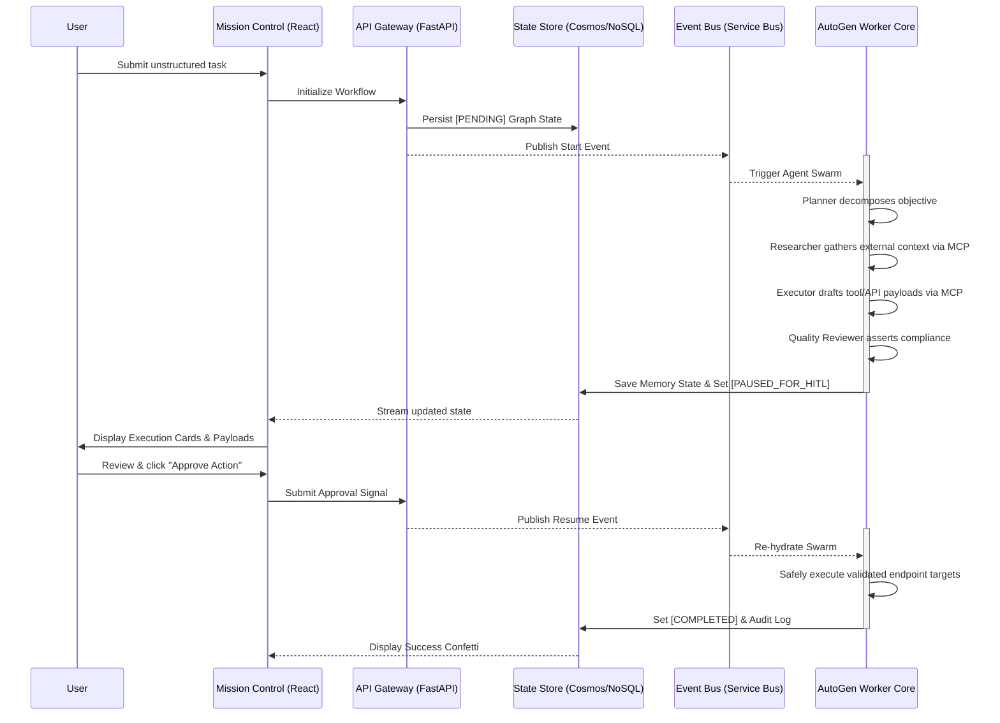
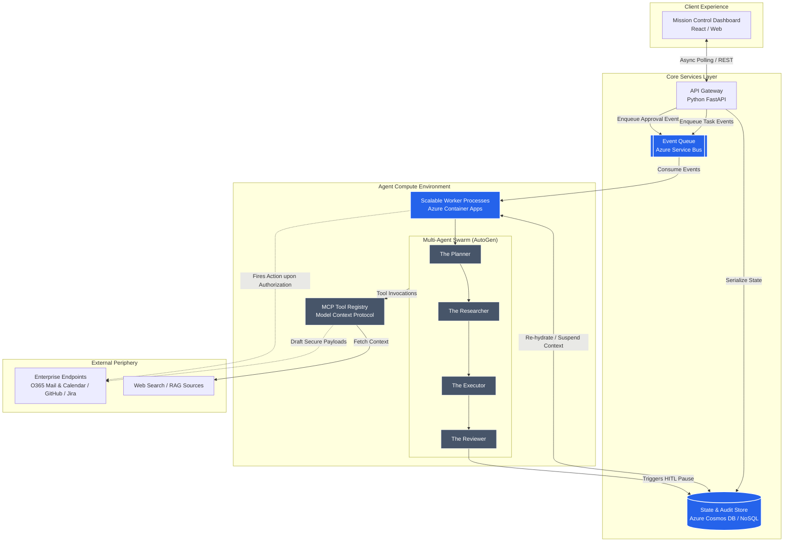

# OrchestrAI Presentation

---

## Slide 1: Problem Statement & Context

**What problem are you solving, and for whom?**

*   **The Overwhelmed Professional:** We are building this for Project Managers, Operations Leads, Startup Founders, and SMBs who are drowning in the chaos of coordination.
*   **The "Tab-Switching" Epidemic:** A typical manager spends 50%+ of their day bouncing between Slack threads, unread emails, disjointed calendar invites, and tracking spreadsheets just to move a single project one step forward.
*   **The Gap in Current AI:** Existing generative AI solutions are brilliant at answering questions and writing text, but they are *passive*. They act as specialized dictionaries or typists, not as functional digital colleagues. They don't actually *execute the work* autonomously.
*   **The Need for Action, Not Just Chat:** Users don’t need another chatbot window to talk to; they need a system that can be assigned a messy objective like "Set up the Q3 launch review" and will actively handle the legwork of planning, researching, and drafting actionable steps.
*   **Why Now?** The market is screaming for efficiency. Microsoft research highlights that 70% of employees would eagerly delegate administrative "busywork" to AI. The missing link has been a secure, orchestrated framework that can connect reasoning securely to real-world APIs.
*   **The Stakes:** Without true orchestration, organizations face ongoing employee burnout, stalled productivity, and a rigid ceiling on how much a small team can accomplish before "status update fatigue" completely cripples momentum.

---

## Slide 2: Solution Overview

**What have you built?**

*   **A Digital Workforce, Not a Chatbot:** OrchestrAI is an autonomous, multi-agent orchestration framework wrapped in a "Mission Control" web interface. It behaves like a highly capable virtual team rather than a text generator.
*   **Core Value Proposition - "Delegation at Scale":** It allows users to issue high-level, natural language directives. The system autonomously decomposes the request, researches context, coordinates between specialized sub-agents, and prepares the execution of external actions (e.g., sending automated emails, scheduling calendar invites, or updating CRM records).
*   **The End-to-End Workflow:** 
    1.  **Assign:** User drops a vague goal into the dashboard.
    2.  **Orchestrate:** The framework translates the goal into sub-tasks and assigns them to specialized agents (e.g., Planner, Researcher, Executor).
    3.  **Draft:** The agents collaborate asynchronously, fetching web data and prepping API payloads.
    4.  **Verify (HITL):** The system strictly halts and presents a drafted action plan to the user for a final "thumbs up."
    5.  **Execute:** Upon approval, the action securely executes against real-world endpoints.
*   **Our Distinct Advantage - Engineered for Enterprise Safety:** We solve the primary fears of corporate AI: hallucinations and out-of-control execution. By mandating Human-in-the-Loop (HITL) checkpoints before any write-action occurs, and utilizing a decoupled asynchronous backend, we guarantee verifiable, secure workflows that never lock up the user interface.

---

## Slide 3: Key Features & User Flow

**How does it work end to end?**

**Top 5 Technical Features:**
1.  **Distributed Multi-Agent Topology:** Distinct, specialized agent personas (Planner, Context Gatherer, Execution Drafter, Quality Reviewer) collaborating via the Microsoft AutoGen framework.
2.  **Framework-Agnostic LLM Routing:** Our architecture is designed to map the right AI model to the right task (e.g., expensive heavy-weight models for complex multi-step planning, and high-speed, cost-effective models for repetitive data extraction).
3.  **Strict Human-in-the-Loop (HITL) Halts:** Agents are firewalled from direct external mutation. They must output a serialized `PENDING_APPROVAL` state, halting the backend loop until a human explicitly signs off.
4.  **Asynchronous Message Brokering:** Heavy LLM reasoning cycles are decoupled from the UI using Azure Service Bus, guaranteeing a snappy React frontend even when background agents debate a task for minutes.
5.  **Stateful Memory Resumption:** Workflows can be paused for days. The entire agent graph memory is saved securely in a NoSQL database and instantly re-hydrated back into the worker node when the user resumes the task.
6.  **Standardized Tool Integration via MCP:** Built entirely on the Model Context Protocol (MCP) to supply the agents with dynamically loaded, framework-agnostic tools (e.g., Mail Delivery, Calendar Scheduling). This abstracts the underlying logic of APIs and avoids brittle, hardcoded function wrappers.

**User Flow Sequence:**

---

## Slide 4: Architecture & Technology Approach

**How is your prototype built?**

Our blueprint emphasizes extreme scalability, decoupled boundaries, and cloud-native resilience, heavily tailored to the Azure ecosystem while maintaining modularity.

**Core Conceptual Structure:**
*   **The Command Center (Frontend):** A React-based split-pane dashboard that visualizes the invisible. It provides live telemetry of agent conversations and presents clear, isolated UI cards for manual override and approval.
*   **The API Gateway (Backend):** A Python FastAPI layer acting as the traffic cop. It handles authentication, validation, and state serialization without ever blocking to wait on LLM responses.
*   **The Asynchronous Spine (Event Bus):** Because multi-agent loops are highly variable in duration, we utilize Azure Service Bus. This queueing system ensures we never drop tasks under load and allows workers to scale independently from the gateway.
*   **The Agent Arena (Worker Nodes):** Hosted on scale-to-zero container apps, these Python workers pull jobs from the queue, spin up the AutoGen team, re-hydrate past conversational memory, and run the LLM loop until the Reviewer agent halts the process.
*   **The Central Tool Registry (MCP):** Connects the swarm dynamically to real-world tasks via the Model Context Protocol (MCP), surfacing tools uniformly to the agents while remaining highly isolated from their reasoning logic.
*   **The Engine Room (AI Routing):** Instead of a monolithic model, we designed a flexible routing layer that can hot-swap foundational models via Azure OpenAI/Foundry. This allows us to use top-tier instruction models for the "Planner" and highly-quantized, latency-optimized SLMs for simple API mapping.

**High-Level Architecture Diagram:**

---

## Slide 5: Design Decisions & Trade-offs

**Why did you build it this way?**

Building a robust, real-world multi-agent system in a hackathon environment required ruthless prioritization. 

**What We Prioritized:**
*   **Total Decoupling over Simplicity:** We refused to write a simple monolithic script. Deploying Service Bus and asynchronous workers was harder, but it’s the only legitimate way to run unbounded LLM loops without crashing web servers with latency timeouts.
*   **Security by Design (The HITL Imperative):** We deliberately stripped autonomous writing permissions from all agents. In an enterprise context, speed is irrelevant if trust is broken. Pausing the simulation engine exactly before the "point of no return" was our absolute top requirement.
*   **Model Agnosticism (Tiered Strategy):** We architected the system to be model-fluid. By abstracting the LLM endpoints, we can instantly switch between a massive frontier model for complex reasoning and a smaller, cheaper model for data parsing, maximizing our budget and execution speed.

**What We Left Behind (Trade-offs & Constraints):**
*   **Dropped Real-Time WebSockets:** We wanted a buttery-smooth live-typing animation in the UI via WebSockets. However, distributed state management for WebSockets across workers is complex. We compromised with optimized HTTP polling to ensure stability over flashiness.
*   **Skipped Custom Model Fine-Tuning:** Training specific SLMs on corporate APIs would have increased accuracy, but time and compute constraints boxed us out. We heavily compensated by leveraging the "Reviewer" agent to dynamically enforce strict Pydantic parsing rules instead.
*   **Constrained Tool Sandbox:** Rather than giving the agents open-ended access to run arbitrary Python code or touch local file systems, we intentionally sandboxed their tools to a whitelist of pre-defined API wrappers (like Search, Email Automation, and Calendar Scheduling) to mitigate immediate security risks during the prototype phase.

---

## Slide 6: Current Status, Limitations & Next Steps

**Where you are now, and what comes next**

We have successfully transitioned from a conceptual architecture to an end-to-end, functional prototype, but we recognize the road to enterprise readiness requires further scaling.

**What is Fully Functional Today:**
*   **The Orchestration Engine:** The AutoGen multi-agent loop successfully distributes roles between the Planner, Researcher, Executor, and Reviewer.
*   **The Safety Net (HITL):** Decoupled Cosmos DB state management reliably suspends agent workflows, presenting drafted API payloads to the React dashboard awaiting manual human authorization.
*   **The Asynchronous Backbone:** Azure Service Bus correctly cues events between the API gateway and the worker containers, preventing HTTP timeouts during complex LLM reasoning.
*   **Tiered Model Integrations:** The modular architecture successfully routes requests to different frontier/quantized endpoints based on the assigned agent profile.

**What is Partially Implemented / Known Limitations:**
*   **Limited "Tool" Ecosystem:** Right now, the Executor agent is only wired to dummy REST endpoints representing a curated set of actions (e.g., Email sending, Calendar scheduling, Web Search). Deep, authenticated integrations via OAuth (like Microsoft Graph API or Atlassian Suite) are mocked for prototype speed.
*   **Polling Latency:** The React frontend polls Cosmos DB every few seconds for UI telemetry updates. Under heavy load, this could lead to API rate limiting, making it less efficient than a persistent WebSocket connection.
*   **Static Guardrails:** The Reviewer agent relies heavily on system prompts instead of hardcoded programmatic schema validation. Complex edge cases might still trigger a retry loop if the LLM struggles to parse the payload perfectly.

**Planned Improvements & Mentorship Focus:**
*   **Security & Identity (OAuth 2.0 Integration):** We need mentorship on securely passing user tokens (Azure AD) down to the worker nodes so agents execute actions *on behalf of the specific user*.
*   **SignalR / WebSockets Migration:** We plan to refactor the frontend polling mechanism to Azure SignalR to achieve true real-time, bidirectional telemetry streaming between the executing agents and the Mission Control UI.
*   **"Time-Trave" Memory Branches:** We want to build an interface feature allowing users to reject an agent's drafted plan, rewind the Cosmos DB state to an earlier node, provide structural feedback, and fork a new simulation timeline.
