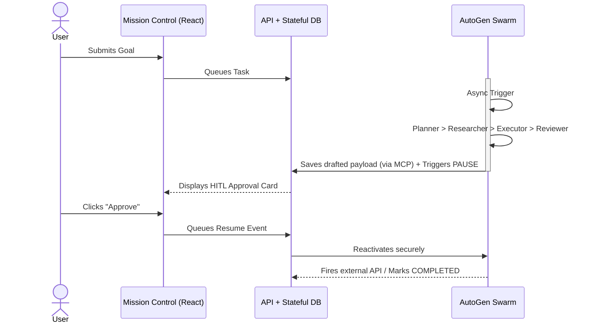
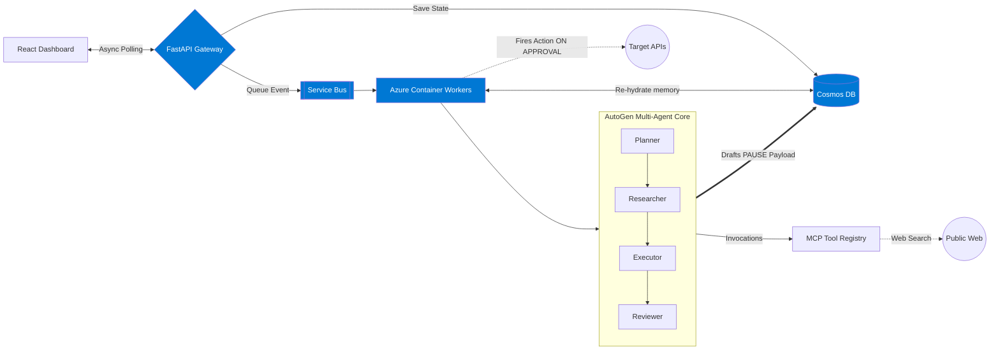

# OrchestrAI Presentation

---

## Slide 1: Problem Statement & Context
*(Keep to 5-6 crisp bullet points)*

**The "Tab-Switching" Epidemic for PMs & Ops Leads**

*   **Who the user is:** Project Managers, Ops Leads, and Startup Teams in SMBs.
*   **The Challenge:** Users drown in "tab-switching" (Slack, email, Jira), managing work rather than doing it.
*   **The Gap in Current AI:** Existing generative AI acts as a passive dictionary or typist; it cannot *execute* multi-step tool workflows autonomously.
*   **Why Solve Now?:** 70% of employees want to delegate administrative "busywork" to AI to regain strategic bandwidth (Microsoft Research).
*   **The Missing Link:** A secure, orchestrated framework linking reasoning securely to real-world impact.
*   **Impact if Unsolved:** Crippling "status update fatigue," stalled productivity, and a rigid ceiling on team scaling.

---

## Slide 2: Solution Overview
*(High-level executive summary)*

**OrchestrAI: A Digital Workforce, Not a Chatbot**

*   **What it is:** An autonomous, multi-agent orchestration framework wrapped in a "Mission Control" web interface. 
*   **Primary Value:** Enables **"Delegation at Scale"** by translating natural language goals into researched, coordinated, and executable API actions. 
*   **The Workflow:** 
    1. **Assign:** User inputs a vague objective (e.g., "Set up launch review").
    2. **Orchestrate:** Framework assigns sub-tasks to specialized sub-agents.
    3. **Verify:** System strictly halts, presenting drafted actions for a final "thumbs up".
    4. **Execute:** Target APIs trigger securely.
*   **Our Distinct Advantage:** **Enterprise Safety.** We eliminate hallucination fears via mandated Human-in-the-Loop (HITL) checkpoints and a decoupled asynchronous backend.

---

## Slide 3: Key Features & User Flow
*(3-5 Top Features + Flow Diagram)*

**Top Technical Features**
1. **Multi-Agent Topology:** Distinct Planner, Researcher, Executor, and Reviewer personas collaborating via AutoGen.
2. **Framework-Agnostic Routing:** dynamically routes tasks to expensive complex models or fast, cheap SLMs to optimize budget.
3. **Strict HITL Halts:** Agents emit `PENDING_APPROVAL` states, enforcing manual sign-off before any external action.
4. **Async Message Brokering:** Azure Service Bus decouples LLM logic from the UI, ensuring the React frontend never hangs. 
5. **Stateful Memory Resumption:** Cosmos DB persists workflow graphs, allowing tasks to pause and resume perfectly days later.
6. **Standardized Tool Integration (MCP):** Dynamic connection to enterprise APIs via the Model Context Protocol, removing the need for rigid tool schemas.

**User Flow Diagram** *(Keep it clean and visual)*

---

## Slide 4: Architecture & Technology Approach
*(Conceptual System Design)*

**Built for Azure-Native Scalability and Security**
*   **Command Center (Frontend):** React dashboard streaming live agent telemetry and isolated HITL approval cards.
*   **API Gateway (Backend):** FastAPI layer handling validation and state serialization without blocking on LLMs.
*   **Asynchronous Spine (Event Bus):** Azure Service Bus queues prevent timeouts by decoupling heavy agent loops from the gateway.
*   **Agent Arena (Worker Nodes):** Scale-to-zero Container Apps that pull jobs, hydrate memory, and run the AutoGen loop.
*   **Tool Registry (MCP):** Model Context Protocol layer seamlessly bridging AutoGen reasoning with external enterprise tools.
*   **Engine Room (AI Routing):** Flexible routing to hot-swap between frontier models (Planner) and latency-optimized SLMs (Executor). 

**System Architecture Visual**

---

## Slide 5: Design Decisions & Trade-offs
*(Demonstrate Maturity)*

**Strategic Prioritization vs. Hackathon Realities**

*   **Prioritized:** **Total Decoupling over Monoliths.** We used asynchronous queues (Service Bus) rather than simple synchronous APIs to ensure long LLM reasoning loops wouldn't crash web browsers with timeouts. 
*   **Prioritized:** **Security by Design.** We stripped agents of autonomous writing permissions. Speed is useless without trust; the hard HITL pause is a mandatory feature, not a bug. 
*   **Trade-off:** **Frontend Polling over WebSockets.** Implementing distributed WebSocket state across container workers is complex. We opted for stable Cosmos DB HTTP polling to guarantee reliability over flashy live-typing animations.
*   **Trade-off:** **Curated Tools vs. Open Sandboxes:** We mocked deep OAuth API integrations (like MsGraph) and sandboxed agents to pre-approved wrappers to mitigate immediate security risks during this sprint.

---

## Slide 6: Current Status & Next Steps
*(Honesty on Prototype vs. Product)*

**Where we are, and where we're going:**

*   **Fully Functional Today:** 
    * The AutoGen framework successfully distributes sub-roles. 
    * Asynchronous Service Bus buffering prevents all API timeouts.
    * The Cosmos DB HITL pipeline reliably suspends and resumes memory. 
*   **Known Prototype Limitations:**
    * The "Executor" targets dummy enterprise endpoints for speed.
    * Polling latency under heavy load can feel slower than true sockets.
*   **Planned Refinements (Mentorship Goals):**
    * **OAuth 2.0 Integration:** Passing user tokens (Azure AD) to agents to ensure they execute actions strictly on behalf of the authenticated user.
    * **SignalR Migration:** Upgrading frontend polling to Azure SignalR for true real-time, low-latency telemetry streaming.
    * **"Time-Travel" Memory:** Allowing users to reject an agent's plan, rewind state, and fork a new simulation timeline.
